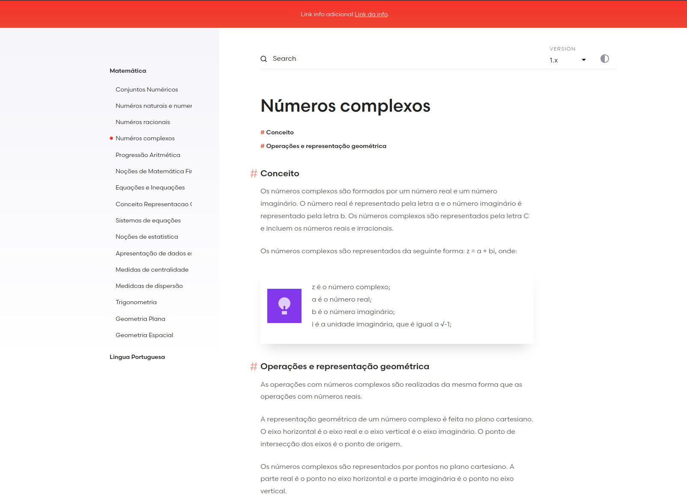

### Aplicação para salvar anotações dos meus estudos

> **Note**
> Este repositório usa o site da documentação do [Laravel](https://github.com/laravel/laravel.com), com uma página inicial limpa e pequenos ajustes no layout

### Variáveis a serem trocadas no .env
- **APP_INITIAL_PROJECT** é o projeto padrão. Cada projeto é uma pasta dentro de /laravel/resources/docs
- **APP_INITIAL_DOC_PAGE** é a página padrão do seu projeto padrão que será carregada
- **APP_SSL** indica se as URLS do seu site carregarão como http (false) ou https (true)

### Informações do Sistema

#### Versão da imagem do Nginx
    1.25.1

#### Versão do Laravel
    10.0

#### Versão do PHP
    8.2.7

#### Extensões do PHP
    php8.2-fpm
    php8.2-mbstring
    php8.2-soap
    php8.2-gd
    php8.2-xml
    php8.2-intl
    php8.2-dev
    php8.2-curl
    php8.2-zip
    php8.2-imagick
    php8.2-gmp
    php8.2-ldap
    php8.2-bcmath
    php8.2-bz2
    php8.2-phar
    php8.2-mysql
    php8.2-sqlite3
    php8.2-sqlsrv
    php8.2-pdo_sqlsrv

#### Pasta Raiz
    /laravel

### Rodando a aplicação

#### Acesse a pasta do projeto
    $ cd repositorio-de-estudos

#### Crie uma nova rede do docker chamada proxy
    $ docker network create proxy

#### Faça uma cópia do docker-compose.example.yml com o nome docker-compose.yml
    $ cp docker-compose.example.yml docker-compose.yml

#### Use a stack docker-compose.yml para iniciar um traefik como proxy reverso e um webserver
    $ docker-compose -d

#### Faça um cópia do .env.example com o nome .env e edite-o conforme suas necessidades. Não esqueça de inserir seu API TOKEN do TORCHLIGHT
    $ cp .env.example .env

#### Acesse o container do webserver
    $ docker exec -it app-estudo /bin/bash

#### Gere uma nova chave da aplicação 
    # php artisan key:generate

#### Instale as dependências do composer e npm
    # composer install
    # npm install

#### Saia do container
    # exit

#### Faça o ajuste nas permissões de algumas pastas (você deve estar na pasta do projeto)
    # chgrp -R www-data storage bootstrap/cache
    # chmod -R ug+rwx storage bootstrap/cache

#### Deixe rodando o _npm run dev_ no seu container
    $ docker exec -itd app-estudo npm run dev
